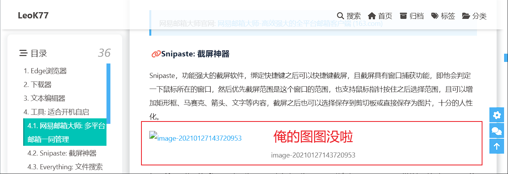

# blog-leok77-old-pdf

## LeoK77的旧版个人博客内容PDF备份

之前使用的图床是Gitee，现在（实际上似乎2022年3月25号起）这种图床使用方法被Gitee给Ban了（网页端），如下图所示，我博客上的图片已经都无法显示了。如果只是本地浏览markdown源文件的话，是可以正常显示的。

实际上这件事我早就发现了，但一直没有写博客的动力，快一年（此文写于2022-11-16，上次更新博客好像是2022-01-23）没有更新内容了。

最近希望重新拾起自己的博客，所以这烂摊子多少得收拾一下，我知道可以直接使用picgo插件迁移图床，但是怎么说呢，之前写的这些内容都太草率了，我不想维护，打算直接推掉所有的博客然后重新写，那么这些旧的内容，我就把他们都转换成PDF然后储存在这个仓库里了。当然也正是因为我不想维护，所以这些PDF也只是处于“能看”的地步，我不想专门排版以及纠错，所以想看的就将就看吧。

以上就是[这个仓库](https://github.com/leok77/blog-leok77-old-pdf)的起源。
